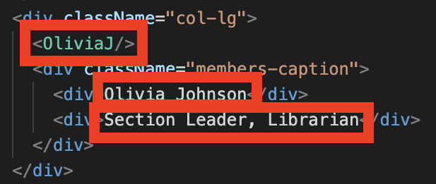

### How to Update this Website
## Guide to adding new piccolo members and taking off alumni

1. Get short bios and images from any members that you would like to add
    - If images are not square, crop them
    - If images are not png or jpg, convert them
    - Store all images in the repo under ./src/images/profile_images
2. Update ./src/components/members.jsx 
    - Add import statements for each new member, following the format for existing members
    - Update the season year and number of members in the description at the top of the first nested div
    - For each class year, there is a grid of cards with each card being a member. It is four cards to a row. Copy and paste members, rows, or an entire class year as needed and change the name and band title. You must also change the component name that is in the first box in the following image to match your import statements at the top. For example, the import statement for the member in the example image is `import OliviaJ from './shared/olivia_johnson.jsx;` so the component name is `OliviaJ` 
    
    - I chose to have it by alphabetically by year, feel free to get creative!
3. Include a .jsx file in ./src/components/shared for every member
    - There is a sample default profile ./src/components/shared/default_profile.jsx that has what each of these files should look like and indicates what needs to be changed to include a bio and a member-submitted image
    - when testing, double check that the bios are not running beyond the cards - sometimes you need to make them a little shorter so it fits on the card
    - React does not allow for variable file paths at the time this guide is being created, otherwise all of these files could be condensed into one master profile component that takes bio and image file path props that could be passed from the members page. Feel free to experiment with this to avoid all of the redundant code  - though be warned I have spent quite a few hours trying unsuccessfully
    - You could use bios and images from previous years, I just chose not to. It was just easier for me to keep track while updating to have everyone resubmit and take out people who did not instead of just asking for new members. I also though that people might want different pictures or bio information might change, so I thought it would be best to do a total refresh each year. Feel free to do whatever makes the most sense to you
4. Feel free to check out the other web pages (like about.jsx, contact.jsx, or faq.jsx in the components folder) to see if there's anything you would like to update there
5. Build, run, and test before pushing!